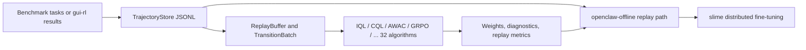

# OpenClaw-RL-Offline

OpenClaw-RL-Offline is a benchmark-aware offline fork of OpenClaw-RL.

It keeps the original online method folders for reproducibility, and adds a clearer offline stack for three concrete jobs:

- collecting benchmark trajectories into replayable JSONL stores;
- training lightweight offline RL baselines on those trajectories;
- replaying the same data back into the original slime-based LLM training path.

Documentation:

- English overview: this file
- Chinese overview: [README.zh-CN.md](./README.zh-CN.md)
- Offline implementation status: [offline-rl/docs/implementation_status.md](./offline-rl/docs/implementation_status.md)
- Offline package details: [offline-rl/README.md](./offline-rl/README.md)
- slime bridge details: [openclaw-offline/README.md](./openclaw-offline/README.md)

## Offline Workflow At A Glance



[](LICENSE)
[](https://www.python.org/)
[](#status)

## What This Fork Adds

- A standalone [offline-rl](./offline-rl) package with trajectory storage, replay sampling, offline data source adapters, and offline RL algorithms.
- Unified mock benchmark support for OSWorld, AndroidWorld, WebArena, and AlfWorld.
- A dedicated [openclaw-offline](./openclaw-offline) bridge that replays offline trajectories into the original slime training stack.
- Benchmark-specific offline launcher wrappers for OSWorld, AndroidWorld, WebArena, and AlfWorld.
- Windows-friendly PowerShell wrappers for benchmark collection, plus PowerShell forwarding entry points for offline training.
- Documentation rewritten around the components that are actually present in this repository snapshot.

## What Is Actually Implemented

| Component | Status | Notes |
|---|---|---|
| `offline-rl` data layer | Real | `TrajectoryStore`, `ReplayBuffer`, prioritized sampling, and slime-compatible replay data source are implemented and tested. |
| `IQL`, `CQL`, `AWAC` | Real lightweight baselines | These are functional offline RL algorithms built around small text encoders for CPU validation and research iteration. |
| `TD3+BC` | Real lightweight baseline | TD3 with behavior cloning regularization (Fujimoto & Gu, NeurIPS 2021); deterministic actor; BC + normalized Q loss. |
| `EDAC` | Real lightweight baseline | Ensemble-diversified actor-critic (An et al., NeurIPS 2021); N Q-critics (default 10) with diversity penalty; SAC-style stochastic actor; auto-tuned temperature. |
| `Decision Transformer` | Real lightweight baseline | Return-conditioned causal sequence model (Chen et al., NeurIPS 2021); 3-token (R, s, a) interleave; offline policy as supervised learning on trajectory sequences. |
| `CRR` | Real lightweight baseline | Critic-regularized regression (Wang et al., NeurIPS 2020); MC V-baseline advantage weighting; exp / binary / softmax filters; selective BC update. |
| `RW-FT` | Real lightweight baseline | Reward-weighted fine-tuning (Mukherjee et al., NeurIPS 2025); trajectory-level outcome reward as softmax BC weight; no critic; simplest offline LLM agent training. |
| `OREO` | Real lightweight baseline | Soft Bellman offline RL (Wang et al., arXiv 2412.16145); single Q + GaussianActor; V_soft = β·log_mean_exp(Q/β) over MC samples; MaxEnt entropy objective; validated on ALFWorld. |
| `SORL` | Real lightweight baseline | Stabilized off-policy GRPO (Li et al., arXiv 2511.20718); clipping-triggered normalization (CTN) skips advantage normalization when IS ratio is stable; long-horizon gradient collapse prevention. |
| `ARPO` | Real lightweight baseline | Adaptive replay GRPO (arXiv 2505.16282); per-task success buffer injects 1 past success when training group is all-fail; DAPO asymmetric clipping; no KL; OSWorld validated. |
| `Retrospex` | Real lightweight baseline | Frozen-LLM offline critic (Xiang et al. EMNLP 2024, arXiv 2505.11807); trains IQL twin Q+V offline, never updates LLM weights; `rescore_actions()` combines LLM log-probs + λ·Q(s,a) at inference. |
| `WebRL` | Real lightweight baseline | ORM-augmented off-policy GRPO (Qi et al. ICLR 2025, arXiv 2411.02337); binary ORM classifier converts sparse outcome labels into dense per-step rewards; curriculum difficulty tracker reports batch zone (easy/medium/hard). |
| `GLIDER` | Real lightweight baseline | Hierarchical offline RL (Hu et al. ICML 2025, arXiv 2505.19761); `PlanEncoder` maps states to latent plan embeddings, high-level IQL V_H on outcome rewards, low-level IQL Q+actor conditioned on plan; reduces effective credit-assignment horizon. |
| `ArCHer` | Real lightweight baseline | Hierarchical IQL+AWR for multi-turn dialogue agents (Zhou et al. ICML 2024, arXiv 2402.19446); twin-Q + V with expectile regression (tau=0.9); AWR actor; three separate optimizer groups. |
| `BCQ` | Real lightweight baseline | Batch-constrained Q-learning (Fujimoto et al. ICML 2019, arXiv 1812.02900); explicit BehaviorCloningNetwork constrains policy near data; twin-Q + V; prevents extrapolation error. |
| `DPO` | Real lightweight baseline | Direct preference optimization for LLM alignment (Rafailov et al. NeurIPS 2023, arXiv 2305.18290); eliminates reward model; intra-batch pairing by outcome reward threshold. |
| `KTO` | Real lightweight baseline | Kahneman-Tversky optimization for binary feedback (Ethayarajh et al. ICML 2024, arXiv 2402.01306); single transitions with binary labels; no preference pairs required. |
| `REBEL` | Real lightweight baseline | Critic-free pairwise reward regression (Gao et al. NeurIPS 2024, arXiv 2404.16767); no value function; lightest-weight RL algorithm in the library. |
| `DigiRL` | Real lightweight baseline | Doubly-robust offline RL for device-control agents (Bai et al. arXiv 2406.11896, 2024); BCE value functions; DR advantage; hard-filter AWR actor. |
| `DigiQ` | Real lightweight baseline | Three-stage offline RL for device-control agents (Bai et al. ICLR 2025, arXiv 2502.15760); Stage I BCE representation fine-tuning, Stage II TD(0) Q/V learning with target networks, Stage III Best-of-N policy extraction. |
| `Agent Q` | Real lightweight baseline | MCTS-guided off-policy DPO for autonomous web agents (Putta et al. 2024, arXiv 2408.07199); combines MCTS empirical returns with learned critic via Q = α·Q_mcts + (1-α)·Q_critic; node-level preference pairs with threshold filtering; off-policy DPO using stored behavior log-probs. |
| `ILQL` | Real lightweight baseline | Implicit Language Q-Learning for NLG (Snell et al. ICLR 2023, arXiv 2206.11871); extends IQL with CQL conservative penalty, advantage-weighted behavioral cloning (AWAC-style policy extraction), and decoding-time value guidance. |
| `IPO` | Real lightweight baseline | Identity preference optimization (Azar et al., AISTATS 2024, arXiv 2310.12036); squared-error loss bypassing BT model; same pairing mechanism as DPO. |
| `CPO` | Real lightweight baseline | Contrastive preference optimization (Xu et al., ICML 2024, arXiv 2401.08417); DPO + behavior cloning regularization on winners. |
| `SimPO` | Real lightweight baseline | Simple preference optimization (Meng et al., NeurIPS 2024, arXiv 2405.14734); reference-free — no reference model needed; 50% less memory. |
| `DMPO` | Real lightweight baseline | Direct multi-turn preference optimization (Shi et al., EMNLP 2024, arXiv 2406.14868); length-normalized DPO for multi-turn agent trajectories. |
| `ETO` | Real lightweight baseline | Exploration-based trajectory optimization (Song et al., ACL 2024, arXiv 2403.02502); exploration-weighted DPO; upweights near-miss failures. |
| `VEM` | Real lightweight baseline | Value environment model (Song et al., Microsoft 2025, arXiv 2502.18906); MLP value model + AWR policy; two-stage training. |
| `ORPO` | Monolithic preference optimization (reference-free) | Odds Ratio Preference Optimization (Hong et al. 2024, arXiv 2403.07691); L_ORPO = L_SFT + λ·L_OR where L_OR = −log σ(log(odds_w/odds_l)); no reference model needed. |
| `RRHF` | Ranking-based alignment without PPO | Rank Responses to align Human Feedback (Yuan et al., NeurIPS 2023, arXiv 2304.05302); hinge ranking loss on conditional log-probs aligned with reward scores + SFT anchor. |
| `Off-Policy GRPO` | Real replay-based objective | The trainer now uses replayed behavior-policy log-probs when datasets provide them, and falls back to reference-policy log-probs for legacy data. |
| `openclaw-offline` bridge | Real | Offline trajectories are replayed into the original slime training interfaces instead of being handled by a separate toy trainer. |
| Benchmark adapters | Mixed | Mock adapters for OSWorld, AndroidWorld, WebArena, and AlfWorld are present for CPU validation; real execution still depends on external benchmark stacks. |
| Full LLM fine-tuning | External-runtime dependent | The repository provides the launch path, but actual large-scale training still needs slime, model checkpoints, and a Linux-like multi-GPU environment. |

This repository does not claim to replace the upstream full training runtime. It makes the offline data, replay, and fine-tuning path explicit and easier to validate.

## Which Entry Point Should You Use?

| Goal | Start here | Why |
|---|---|---|
| Validate data collection on CPU | `offline-rl/scripts/collect_from_benchmark.py` | Fastest path to confirm adapters, task configs, and storage schema. |
| Compare lightweight offline algorithms | `offline-rl/scripts/train_offline.py` | Runs IQL, CQL, AWAC, GRPO, TD3+BC, EDAC, DT, CRR, RW-FT, OREO, SORL, ARPO, Retrospex, WebRL, GLIDER, ArCHer, BCQ, DPO, KTO, REBEL, DigiRL, DigiQ, Agent Q, ILQL, IPO, CPO, SimPO, DMPO, ETO, VEM, ORPO, or RRHF on replay data without entering the full slime stack. |
| Benchmark multiple algorithms | `offline-rl/scripts/evaluate_algorithms.py` | Trains all specified algorithms and outputs a comparison table (final loss, trend, Q stats, time) with optional CSV/Markdown export. |
| Produce critic-derived weights | `openclaw-offline/compute_weights.py` | Generates weight files for advantage-weighted fine-tuning. |
| Launch full offline LLM training | `openclaw-offline/run_qwen35_4b_*_offline_rl.{sh,ps1}` | Reuses the original slime training path with offline replay replacing live rollouts. |
| Audit implementation scope | `offline-rl/docs/implementation_status.md` | Separates real implemented features from intentional approximations. |

## Repository Scope

This repository currently centers on three use cases:

1. online OpenClaw optimization with the original method folders;
2. GUI-oriented agent training via [gui-rl](./gui-rl);
3. offline benchmark replay and offline RL extension work via [offline-rl](./offline-rl) and [openclaw-offline](./openclaw-offline).

Unlike the full upstream project page, this README intentionally avoids documenting folders or demos that are not included in this fork.

## Repository Layout

| Folder | Purpose |
|---|---|
| [openclaw-rl](./openclaw-rl) | Binary-RL training path using next-state reward signals |
| [openclaw-opd](./openclaw-opd) | On-policy distillation training path |
| [openclaw-combine](./openclaw-combine) | Combined Binary RL + OPD training path |
| [gui-rl](./gui-rl) | GUI agent data generation and environment integration |
| [offline-rl](./offline-rl) | Offline RL package: data layer, benchmark adapters, and replay-based algorithms |
| [openclaw-offline](./openclaw-offline) | slime integration layer for full offline fine-tuning on replayed trajectories |
| [slime](./slime) | Underlying distributed training framework used by the OpenClaw stack |

## Quick Start

### Option A: Run The Original Online Methods

Use the upstream-compatible method folders when you want online OpenClaw optimization.

```bash
cd slime

# Binary RL
bash ../openclaw-rl/run_qwen35_4b_openclaw_rl.sh

# On-policy Distillation
bash ../openclaw-opd/run_qwen35_4b_openclaw_opd.sh

# Combined Binary RL + OPD
bash ../openclaw-combine/run_qwen35_4b_openclaw_combine.sh
```

For method details, see the per-folder READMEs in [openclaw-rl](./openclaw-rl), [openclaw-opd](./openclaw-opd), and [openclaw-combine](./openclaw-combine).

### Option B: Run The Offline Extension Workflow

Use the offline extension when you want benchmark collection, replay-based RL, or full offline fine-tuning.

#### 1. Collect trajectories

```bash
cd offline-rl

python scripts/collect_from_benchmark.py --env osworld --n 100 --output data/osworld_trajs.jsonl
python scripts/collect_from_benchmark.py --env androidworld --n 100 --output data/androidworld_trajs.jsonl
python scripts/collect_from_benchmark.py --env webarena --n 100 --output data/webarena_trajs.jsonl
python scripts/collect_from_benchmark.py --env alfworld --n 100 --output data/alfworld_trajs.jsonl
```

```powershell
cd offline-rl

.\scripts\run_collect_osworld.ps1
.\scripts\run_collect_androidworld.ps1
.\scripts\run_collect_webarena.ps1
.\scripts\run_collect_alfworld.ps1
```

#### 2. Train a lightweight offline baseline directly in offline-rl

```bash
python scripts/train_offline.py --algo iql --data data/osworld_trajs.jsonl --steps 500
python scripts/train_offline.py --algo cql --data data/webarena_trajs.jsonl --steps 500
python scripts/train_offline.py --algo awac --data data/alfworld_trajs.jsonl --steps 500
python scripts/train_offline.py --algo td3bc --data data/osworld_trajs.jsonl --steps 500 --td3bc-alpha 2.5
python scripts/train_offline.py --algo grpo --data data/osworld_trajs.jsonl --steps 200 --n-policy-updates 2 --device cuda
```

For a shell-style launcher closer to the upstream OpenClaw entry points, use [offline-rl/scripts/run_train_offline.sh](./offline-rl/scripts/run_train_offline.sh) or [offline-rl/scripts/run_train_offline.ps1](./offline-rl/scripts/run_train_offline.ps1) with `OFFLINE_TRAIN_*` environment variables.

The lightweight direct trainer now defaults to `cuda`, so its default behavior is aligned with a GPU machine. Use `--device cpu` only when you intentionally want local CPU validation.

If your dataset stores behavior-policy log-probs in `step.info` or trajectory metadata, the GRPO baseline will use them directly for a more faithful off-policy ratio. See [offline-rl/README.md](./offline-rl/README.md) for the accepted fields.

#### 3. Optionally compute critic-derived weights for slime offline fine-tuning

```bash
cd ../openclaw-offline

python compute_weights.py \
	--data ../offline-rl/data/osworld_trajs.jsonl \
	--output ../offline-rl/data/osworld_iql_weights.json \
	--algo iql \
	--train-steps 500 \
	--beta 3.0
```

#### 4. Launch full slime-based offline fine-tuning

```bash
cd ../openclaw-offline

bash run_qwen35_4b_osworld_offline_rl.sh
bash run_qwen35_4b_androidworld_offline_rl.sh
bash run_qwen35_4b_webarena_offline_rl.sh
bash run_qwen35_4b_alfworld_offline_rl.sh
```

```powershell
cd ..\openclaw-offline

.\run_qwen35_4b_osworld_offline_rl.ps1
.\run_qwen35_4b_androidworld_offline_rl.ps1
.\run_qwen35_4b_webarena_offline_rl.ps1
.\run_qwen35_4b_alfworld_offline_rl.ps1
```

If you prefer the generic launcher, set `OFFLINE_TRAJECTORY_STORE` yourself and then run either [openclaw-offline/run_qwen35_4b_offline_rl.sh](./openclaw-offline/run_qwen35_4b_offline_rl.sh) or `run_qwen35_4b_offline_rl.ps1`.
The PowerShell launchers forward to WSL first and then fall back to Git Bash when available. Full offline training still requires the same Linux-like multi-GPU runtime expected by slime and upstream OpenClaw-RL.

## Recommended Offline Reading Order

1. Read [offline-rl/docs/implementation_status.md](./offline-rl/docs/implementation_status.md) to understand what is production-facing versus intentionally lightweight.
2. Read [offline-rl/README.md](./offline-rl/README.md) for data contracts, supported algorithms, and collector usage.
3. Read [openclaw-offline/README.md](./openclaw-offline/README.md) for slime launch requirements and weight-file behavior.

## Supported Offline Benchmarks

| Benchmark | Mock collection | Task configs | Offline replay wrapper |
|---|---|---|---|
| OSWorld | Yes | Yes | Yes |
| AndroidWorld | Yes | Yes | Yes |
| WebArena | Yes | Yes | Yes |
| AlfWorld | Yes | Yes | Yes |

The mock adapters are designed for CPU validation and repo-level testing. Real benchmark execution still requires the corresponding external packages, simulators, or service environments.

<a id="status"></a>
## Status

- `offline-rl` CPU test suite is passing in this fork.
- Multi-benchmark collection has been validated for OSWorld, AndroidWorld, WebArena, and AlfWorld.
- Short offline-training smoke runs have been validated on replayed benchmark trajectories.
- Off-Policy GRPO can now consume replayed behavior-policy log-probs when the dataset provides them.
- Full-scale LLM training still requires the original slime runtime stack, model checkpoints, and a Linux-like multi-GPU environment.

## Scope Boundaries

- The lightweight offline algorithms are meant for GPU-first but still lightweight validation, ablation, and replay-policy experiments. They are not direct replacements for a full Qwen3-VL policy stack.
- The benchmark adapters included here prioritize a shared interface and repo-level testing; real benchmark fidelity still depends on external environments.
- The PowerShell offline-training launchers are forwarding entry points; real training still runs through WSL or another Linux-like shell environment.
- This fork intentionally keeps the algorithm folders and file layout close to upstream so existing launch and integration patterns remain recognizable.

## Acknowledgement

OpenClaw-RL-Offline is built on top of the original OpenClaw-RL project from Gen-Verse. This fork focuses on making offline RL and benchmark replay a first-class, easier-to-publish part of the repository without rewriting the upstream method organization.

## Hardware Requirements

| Use case | CPU | RAM | GPU / VRAM | Notes |
|---|---|---|---|---|
| CPU validation (data, adapters, algorithms) | Any modern 4-core | 8 GB | Not required | All offline-rl tests pass on a CPU-only machine. |
| Lightweight offline baseline training (GPU path) | Any modern 8-core | 16 GB | CUDA GPU, 6 GB+ VRAM | `train_offline.py` default is `--device cuda`. |
| Full LLM offline fine-tuning | 16-core+ | 64 GB+ | 8× A100 80 GB (recommended) | Depends on upstream slime and Megatron runtime. |

For CPU-only development, pass `--device cpu` explicitly to all training entry points.

## Installation

### Prerequisites

- Python 3.7 or later (3.9+ recommended for full upstream compatibility)
- PyTorch 1.12+ (CPU build sufficient for validation; CUDA build required for GPU training)
- Git

### Quickest path: offline-rl package only

```bash
git clone https://github.com/MING-ZCH/OpenClaw-RL-Offline.git
cd OpenClaw-RL-Offline/offline-rl

python -m venv .venv
source .venv/bin/activate       # Linux / macOS
# .venv\Scripts\activate       # Windows PowerShell

pip install -e .
python -m pytest tests -v       # All tests should pass on CPU
```

### Full offline workflow (offline-rl + openclaw-offline bridge)

```bash
# Install offline-rl package
pip install -e offline-rl/

# The openclaw-offline bridge uses the same Python environment.
# No separate install needed; just make sure offline-rl is on PYTHONPATH
# when running openclaw-offline scripts.
```

### GPU training setup

```bash
# Install PyTorch with CUDA support first:
pip install torch torchvision torchaudio --index-url https://download.pytorch.org/whl/cu118

# Then install offline-rl:
pip install -e offline-rl/

# Verify CUDA is visible:
python -c "import torch; print(torch.cuda.is_available())"
```

### Full upstream LLM training (slime + Megatron)

See [slime/README.md](./slime/README.md) for detailed multi-GPU setup instructions. Full training requires:

- A Linux-like environment (native Linux or WSL2 on Windows)
- Megatron-LM installed and on `PYTHONPATH`
- Model checkpoints for Qwen3-VL or equivalent

## Contact

- **Chen-Hao (Leo) Chang** (张辰皓)
- GitHub: [@MING-ZCH](https://github.com/MING-ZCH)
- Email: [leo.chenhaozhang@gmail.com](mailto:leo.chenhaozhang@gmail.com) / [ch_zhang@hust.edu.cn](mailto:ch_zhang@hust.edu.cn)
- Homepage: [https://ming-zch.github.io/](https://ming-zch.github.io/)