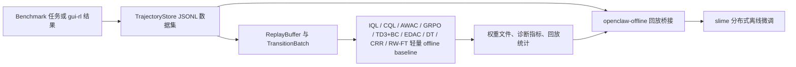

# OpenClaw-RL-Offline

OpenClaw-RL-Offline 是基于 OpenClaw-RL 的一个离线强化学习分支，核心目标不是重写 upstream，而是把原来分散、隐含的 offline 数据收集、回放训练和基于 slime 的离线微调链路整理成一个更容易验证和发布的仓库版本。

英文总览见 [README.md](./README.md)。离线实现边界说明见 [offline-rl/docs/implementation_status.md](./offline-rl/docs/implementation_status.md)。

## 离线工作流总览



## 这个仓库当前真实实现了什么

| 模块 | 当前状态 | 说明 |
|---|---|---|
| `offline-rl` 数据层 | 完整可用 | 包含 `TrajectoryStore`、`ReplayBuffer`、优先级采样、slime 兼容数据源。 |
| `IQL` / `CQL` / `AWAC` | 真实实现 | 都有可运行训练循环、指标输出和 CPU 测试。 |
| `TD3+BC` | 真实实现 | Fujimoto & Gu NeurIPS 2021 算法；确定性 actor + BC 正则化；支持延迟 actor 更新。 |
| `EDAC` | 真实实现 | An et al. NeurIPS 2021 算法；N 个 Q-critic 集成 + 多样性惩罚；SAC 风格随机 actor；自适应温度。 |
| `Decision Transformer` | 真实实现 | Chen et al. NeurIPS 2021 算法；因果 Transformer；(R, s, a) 三元 token 交织；离线策略作为监督学习。 |
| `CRR` | 真实实现 | Wang et al. NeurIPS 2020 算法；MC V 基线优势加权 BC；exp / binary / softmax 过滤器；仅从正优势步骤更新。 |
| `RW-FT` | 真实实现 | Mukherjee et al. NeurIPS 2025 算法；轨迹级奖励加权 BC；无需 critic；最简单的离线 LLM agent 训练方法。 |
| `Off-Policy GRPO` | 真实实现 | 在数据里提供行为策略 log-prob 时，会直接使用这些离线概率；旧数据则回退到 ref-policy 近似。 |
| `openclaw-offline` | 真实 bridge | 会把离线轨迹重放回原始 slime 训练接口，而不是单独做一个玩具 trainer。 |
| 多 benchmark 采集包装 | 已实现 | OSWorld、AndroidWorld、WebArena、AlfWorld 都有 mock 适配与脚本。 |

## 这个仓库没有夸大什么

- 轻量 offline baseline 使用的是 CPU 友好的小型文本编码器，不是完整 Qwen3-VL 主干。
- mock benchmark 适配器主要用于 repo 级验证，不等价于真实 benchmark 环境。
- PowerShell 启动脚本只是 Windows 宿主机入口，真正的大规模训练仍然依赖 Linux 风格运行时与 slime 栈。

## 推荐阅读顺序

1. 先看 [README.md](./README.md) 了解英文版整体定位和快速开始。
2. 再看 [offline-rl/README.md](./offline-rl/README.md) 了解离线采集、算法和数据格式。
3. 然后看 [openclaw-offline/README.md](./openclaw-offline/README.md) 了解如何把离线数据接回 slime 训练。

## 按目标选择入口

| 目标 | 推荐入口 | 原因 |
|---|---|---|
| 在 CPU 上验证采集流程 | `offline-rl/scripts/collect_from_benchmark.py` | 最快确认 benchmark 适配器、任务配置和数据落盘。 |
| 比较离线算法 baseline | `offline-rl/scripts/train_offline.py` | 不进入完整 slime 栈也能比较 IQL / CQL / AWAC / GRPO / TD3+BC / EDAC / DT / CRR / RW-FT 共 9 种算法。 |
| 生成 critic 权重 | `openclaw-offline/compute_weights.py` | 为 advantage-weighted 微调准备权重文件。 |
| 做完整离线微调 | `openclaw-offline/run_qwen35_4b_*_offline_rl.{sh,ps1}` | 用离线回放替换 live rollout，但仍沿用 upstream slime 训练路径。 |
| 核查实现边界 | `offline-rl/docs/implementation_status.md` | 能最快区分“真实实现”与“有意保留的轻量近似”。 |

## 快速开始

### 1. 采集离线轨迹

```bash
cd offline-rl

python scripts/collect_from_benchmark.py --env osworld --n 100 --output data/osworld_trajs.jsonl
python scripts/collect_from_benchmark.py --env androidworld --n 100 --output data/androidworld_trajs.jsonl
python scripts/collect_from_benchmark.py --env webarena --n 100 --output data/webarena_trajs.jsonl
python scripts/collect_from_benchmark.py --env alfworld --n 100 --output data/alfworld_trajs.jsonl
```

### 2. 训练轻量 offline baseline

```bash
python scripts/train_offline.py --algo iql --data data/osworld_trajs.jsonl --steps 500
python scripts/train_offline.py --algo cql --data data/webarena_trajs.jsonl --steps 500
python scripts/train_offline.py --algo awac --data data/alfworld_trajs.jsonl --steps 500
python scripts/train_offline.py --algo grpo --data data/osworld_trajs.jsonl --steps 200 --n-policy-updates 2
```

如果你的数据里保存了行为策略 log-prob，GRPO 会优先使用真实离线策略概率，而不是只拿 ref-policy 近似。支持的字段说明在 [offline-rl/README.md](./offline-rl/README.md) 里。

### 3. 可选地计算 advantage 权重

```bash
cd ../openclaw-offline

python compute_weights.py \
  --data ../offline-rl/data/osworld_trajs.jsonl \
  --output ../offline-rl/data/osworld_iql_weights.json \
  --algo iql \
  --train-steps 500 \
  --beta 3.0
```

### 4. 启动基于 slime 的离线微调

```bash
bash run_qwen35_4b_osworld_offline_rl.sh
bash run_qwen35_4b_androidworld_offline_rl.sh
bash run_qwen35_4b_webarena_offline_rl.sh
bash run_qwen35_4b_alfworld_offline_rl.sh
```

## 致谢

OpenClaw-RL-Offline 构建在 Gen-Verse 的 OpenClaw-RL 之上。这个分支重点强化的是 offline 数据、回放训练与可发布性，而不是重做 upstream 的方法组织。

## 硬件要求

| 使用场景 | CPU | 内存 | GPU / 显存 | 说明 |
|---|---|---|---|---|
| CPU 验证（数据、适配器、算法） | 4 核及以上 | 8 GB | 不需要 | 所有 offline-rl 测试在纯 CPU 机器上通过。 |
| 轻量 offline baseline 训练（GPU 路径） | 8 核及以上 | 16 GB | CUDA GPU 6 GB+ 显存 | `train_offline.py` 默认 `--device cuda`。 |
| 完整 LLM 离线微调 | 16 核及以上 | 64 GB+ | 8× A100 80 GB（推荐） | 依赖 upstream slime 和 Megatron runtime。 |

如需在纯 CPU 机器上运行，所有训练入口都支持显式传入 `--device cpu`。

## 安装说明

### 环境依赖

- Python 3.7 或以上（推荐 3.9+）
- PyTorch 1.12+（CPU 构建可用于验证；GPU 训练需要 CUDA 构建）
- Git

### 最快路径：只安装 offline-rl 包

```bash
git clone https://github.com/MING-ZCH/OpenClaw-RL-Offline.git
cd OpenClaw-RL-Offline/offline-rl

python -m venv .venv
source .venv/bin/activate       # Linux / macOS
# .venv\Scripts\activate        # Windows PowerShell

pip install -e .
python -m pytest tests -v       # 纯 CPU 机器上所有测试应全部通过
```

### GPU 训练环境

```bash
# 先安装带 CUDA 支持的 PyTorch
pip install torch torchvision torchaudio --index-url https://download.pytorch.org/whl/cu118

# 再安装 offline-rl
pip install -e offline-rl/

# 验证 CUDA 是否可见
python -c "import torch; print(torch.cuda.is_available())"
```

### 完整 LLM 大规模训练（slime + Megatron）

详见 [slime/README.md](./slime/README.md)。完整训练还需要 Linux 风格环境、Megatron-LM 以及 Qwen3-VL 等模型权重。