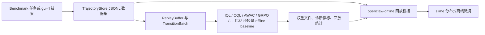

# OpenClaw-RL-Offline

OpenClaw-RL-Offline 是基于 OpenClaw-RL 的一个离线强化学习分支，核心目标不是重写 upstream，而是把原来分散、隐含的 offline 数据收集、回放训练和基于 slime 的离线微调链路整理成一个更容易验证和发布的仓库版本。

英文总览见 [README.md](./README.md)。离线实现边界说明见 [offline-rl/docs/implementation_status.md](./offline-rl/docs/implementation_status.md)。

## 离线工作流总览



## 这个仓库当前真实实现了什么

| 模块 | 当前状态 | 说明 |
|---|---|---|
| `offline-rl` 数据层 | 完整可用 | 包含 `TrajectoryStore`、`ReplayBuffer`、优先级采样、slime 兼容数据源。 |
| `IQL` / `CQL` / `AWAC` | 真实实现 | 都有可运行训练循环、指标输出和 CPU 测试。 |
| `TD3+BC` | 真实实现 | Fujimoto & Gu NeurIPS 2021 算法；确定性 actor + BC 正则化；支持延迟 actor 更新。 |
| `EDAC` | 真实实现 | An et al. NeurIPS 2021 算法；N 个 Q-critic 集成 + 多样性惩罚；SAC 风格随机 actor；自适应温度。 |
| `Decision Transformer` | 真实实现 | Chen et al. NeurIPS 2021 算法；因果 Transformer；(R, s, a) 三元 token 交织；离线策略作为监督学习。 |
| `CRR` | 真实实现 | Wang et al. NeurIPS 2020 算法；MC V 基线优势加权 BC；exp / binary / softmax 过滤器；仅从正优势步骤更新。 |
| `RW-FT` | 真实实现 | Mukherjee et al. NeurIPS 2025 算法；轨迹级奖励加权 BC；无需 critic；最简单的离线 LLM agent 训练方法。 |
| `OREO` | 真实实现 | Wang et al. arXiv 2412.16145；MaxEnt soft Bellman Q+V 联合优化；V_soft = β·log_mean_exp(Q/β)；单个 Q 无需 twin；ALFWorld 验证有效。 |
| `SORL` | 真实实现 | Li et al. arXiv 2511.20718；基于截断触发归一化 (CTN) 的稳定化离策略 GRPO；仅当 IS clip fraction 超阈值时归一化优势；防止长时域 agent 梯度崩溃。 |
| `ARPO` | 真实实现 | arXiv 2505.16282；自适应回放 GRPO；每任务 FIFO 成功轨迹缓冲区（深度 8）；全失败组时注入 1 条历史成功轨迹；DAP O 非对称截断；无 KL 惩罚；OSWorld 验证有效。 |
| `Retrospex` | 真实实现 | Xiang et al. EMNLP 2024（arXiv 2505.11807）；冻结 LLM 策略 + 离线 IQL 双-Q/V 评评子；训练期间永远不更新 LLM 权重；推断时 `rescore_actions()` 将冻结策略的 log-prob 与 Q(s,a) 结合重新排序候选动作。 |
| `WebRL` | 真实实现 | Qi et al. ICLR 2025（arXiv 2411.02337）；离策略 GRPO + 结果监督奖励模型（ORM）；ORM（二分类 MLP）通过轨迹级成功标签训练；增强奖励 r_aug = r_outcome + α·σ(ORM) 将稀疏奖励转为每步密集监督信号；课程难度报告（easy/medium/hard）。 |
| `GLIDER` | 真实实现 | Hu et al. ICML 2025（arXiv 2505.19761）；分层离线 RL；高层 `PlanEncoder` 将状态映射为潜层计划嵌入 g + 基于结果奖励训练 IQL V_H；低层 IQL Q+actor 以计划增强状态为输入；两层均使用 AWR 优势加权；显著缩短长时域任务中的有效 horizon。 |
| `ArCHer` | 真实实现 | Zhou et al. ICML 2024（arXiv 2402.19446）；分层 IQL+AWR 多轮对话 agent；twin-Q + V 期望分位回归 (τ=0.9)；AWR actor；三组独立优化器。 |
| `BCQ` | 真实实现 | Fujimoto et al. ICML 2019（arXiv 1812.02900）；批约束 Q-learning；显式行为克隆网络约束策略在数据分布附近；防止外推误差。 |
| `DPO` | 真实实现 | Rafailov et al. NeurIPS 2023（arXiv 2305.18290）；直接偏好优化；消除奖励模型；基于结果奖励阈值构造 batch 内偏好对。 |
| `KTO` | 真实实现 | Ethayarajh et al. ICML 2024（arXiv 2402.01306）；Kahneman-Tversky 优化；使用单独转移 + 二元标签；不需要配对偏好数据。 |
| `REBEL` | 真实实现 | Gao et al. NeurIPS 2024（arXiv 2404.16767）；无 critic 配对奖励回归；无价值函数；库中最轻量的 RL 算法。 |
| `DigiRL` | 真实实现 | Bai et al. 2024（arXiv 2406.11896）；双稳健离线 RL；BCE 价值函数；DR 优势；硬过滤 AWR actor。 |
| `DigiQ` | 真实实现 | Bai et al. ICLR 2025（arXiv 2502.15760）；三阶段离线 RL；Stage I BCE 表征微调、Stage II TD(0) Q/V 学习 + 目标网络、Stage III Best-of-N 策略提取。 |
| `Agent Q` | 真实实现 | Putta et al. 2024（arXiv 2408.07199）；MCTS 引导的离策略 DPO；结合 MCTS 经验回报与学习型 critic（Q = α·Q_mcts + (1-α)·Q_critic）；节点级偏好对构建 + 阈值过滤；利用存储的行为策略 log-prob 实现离策略 DPO。 |
| `ILQL` | 真实实现 | Snell et al. ICLR 2023（arXiv 2206.11871）；隐式语言 Q 学习；在 IQL 基础上增加 CQL 保守惩罚 + AWAC 风格优势加权行为克隆 + 解码时值引导。 |
| `IPO` | 真实实现 | Azar et al. AISTATS 2024（arXiv 2310.12036）；恒等偏好优化；平方误差损失绕过 Bradley-Terry 模型；与 DPO 相同的配对机制。 |
| `CPO` | 真实实现 | Xu et al. ICML 2024（arXiv 2401.08417）；对比偏好优化；DPO + 胜者行为克隆正则化。 |
| `SimPO` | 真实实现 | Meng et al. NeurIPS 2024（arXiv 2405.14734）；简单偏好优化；免参考模型——不需要 reference model，节省 50% 内存。 |
| `DMPO` | 真实实现 | Shi et al. EMNLP 2024（arXiv 2406.14868）；直接多轮偏好优化；长度归一化 DPO，适用于多轮 agent 轨迹。 |
| `ETO` | 真实实现 | Song et al. ACL 2024（arXiv 2403.02502）；探索式轨迹优化；探索加权 DPO；提升接近成功的失败轨迹权重。 |
| `VEM` | 真实实现 | Song et al. Microsoft 2025（arXiv 2502.18906）；值环境模型；MLP 价值模型 + AWR 策略；两阶段训练。 |
| `ORPO` | 真实实现 | Hong et al. 2024（arXiv 2403.07691）；单体偶好比偏好优化；L_ORPO = L_SFT + λ·L_OR；无参考模型。 |
| `RRHF` | 真实实现 | Yuan et al. NeurIPS 2023（arXiv 2304.05302）；排名损失对齐人类反馈；Hinge 排名损失 + SFT 锚定。 |
| `Off-Policy GRPO` | 真实实现 | 在数据里提供行为策略 log-prob 时，会直接使用这些离线概率；旧数据则回退到 ref-policy 近似。 |
| `openclaw-offline` | 真实 bridge | 会把离线轨迹重放回原始 slime 训练接口，而不是单独做一个玩具 trainer。 |
| 多 benchmark 采集包装 | 已实现 | OSWorld、AndroidWorld、WebArena、AlfWorld 都有 mock 适配与脚本。 |

## 推荐阅读顺序

1. 先看 [README.md](./README.md) 了解英文版整体定位和快速开始。
2. 再看 [offline-rl/README.md](./offline-rl/README.md) 了解离线采集、算法和数据格式。
3. 然后看 [openclaw-offline/README.md](./openclaw-offline/README.md) 了解如何把离线数据接回 slime 训练。

## 按目标选择入口

| 目标 | 推荐入口 | 原因 |
|---|---|---|
| 在 CPU 上验证采集流程 | `offline-rl/scripts/collect_from_benchmark.py` | 最快确认 benchmark 适配器、任务配置和数据落盘。 |
| 比较离线算法 baseline | `offline-rl/scripts/train_offline.py` | 不进入完整 slime 栈也能比较 IQL / CQL / AWAC / GRPO / TD3+BC / EDAC / DT / CRR / RW-FT / OREO / SORL / ARPO / Retrospex / WebRL / GLIDER / ArCHer / BCQ / DPO / KTO / REBEL / DigiRL / DigiQ / Agent Q / ILQL / IPO / CPO / SimPO / DMPO / ETO / VEM / ORPO / RRHF 共32 种算法。 |
| 多算法自动对比评估 | `offline-rl/scripts/evaluate_algorithms.py` | 批量训练指定算法，输出最终损失、收敛趋势、Q 统计、耗时对比表，支持 CSV / Markdown 导出。 |
| 生成 critic 权重 | `openclaw-offline/compute_weights.py` | 为 advantage-weighted 微调准备权重文件。 |
| 做完整离线微调 | `openclaw-offline/run_qwen35_4b_*_offline_rl.{sh,ps1}` | 用离线回放替换 live rollout，但仍沿用 upstream slime 训练路径。 |
| 核查实现边界 | `offline-rl/docs/implementation_status.md` | 能最快区分“真实实现”与“有意保留的轻量近似”。 |

## 快速开始

### 1. 采集离线轨迹

```bash
cd offline-rl

python scripts/collect_from_benchmark.py --env osworld --n 100 --output data/osworld_trajs.jsonl
python scripts/collect_from_benchmark.py --env androidworld --n 100 --output data/androidworld_trajs.jsonl
python scripts/collect_from_benchmark.py --env webarena --n 100 --output data/webarena_trajs.jsonl
python scripts/collect_from_benchmark.py --env alfworld --n 100 --output data/alfworld_trajs.jsonl
```

### 2. 训练轻量 offline baseline

```bash
python scripts/train_offline.py --algo iql --data data/osworld_trajs.jsonl --steps 500
python scripts/train_offline.py --algo cql --data data/webarena_trajs.jsonl --steps 500
python scripts/train_offline.py --algo awac --data data/alfworld_trajs.jsonl --steps 500
python scripts/train_offline.py --algo grpo --data data/osworld_trajs.jsonl --steps 200 --n-policy-updates 2
```

如果你的数据里保存了行为策略 log-prob，GRPO 会优先使用真实离线策略概率，而不是只拿 ref-policy 近似。支持的字段说明在 [offline-rl/README.md](./offline-rl/README.md) 里。

### 3. 可选地计算 advantage 权重

```bash
cd ../openclaw-offline

python compute_weights.py \
  --data ../offline-rl/data/osworld_trajs.jsonl \
  --output ../offline-rl/data/osworld_iql_weights.json \
  --algo iql \
  --train-steps 500 \
  --beta 3.0
```

### 4. 启动基于 slime 的离线微调

```bash
bash run_qwen35_4b_osworld_offline_rl.sh
bash run_qwen35_4b_androidworld_offline_rl.sh
bash run_qwen35_4b_webarena_offline_rl.sh
bash run_qwen35_4b_alfworld_offline_rl.sh
```

## 致谢

OpenClaw-RL-Offline 构建在 Gen-Verse 的 OpenClaw-RL 之上。这个分支重点强化的是 offline 数据、回放训练与可发布性，而不是重做 upstream 的方法组织。

## 硬件要求

| 使用场景 | CPU | 内存 | GPU / 显存 | 说明 |
|---|---|---|---|---|
| CPU 验证（数据、适配器、算法） | 4 核及以上 | 8 GB | 不需要 | 所有 offline-rl 测试在纯 CPU 机器上通过。 |
| 轻量 offline baseline 训练（GPU 路径） | 8 核及以上 | 16 GB | CUDA GPU 6 GB+ 显存 | `train_offline.py` 默认 `--device cuda`。 |
| 完整 LLM 离线微调 | 16 核及以上 | 64 GB+ | 8× A100 80 GB（推荐） | 依赖 upstream slime 和 Megatron runtime。 |

如需在纯 CPU 机器上运行，所有训练入口都支持显式传入 `--device cpu`。

## 安装说明

### 环境依赖

- Python 3.7 或以上（推荐 3.9+）
- PyTorch 1.12+（CPU 构建可用于验证；GPU 训练需要 CUDA 构建）
- Git

### 最快路径：只安装 offline-rl 包

```bash
git clone https://github.com/MING-ZCH/OpenClaw-RL-Offline.git
cd OpenClaw-RL-Offline/offline-rl

python -m venv .venv
source .venv/bin/activate       # Linux / macOS
# .venv\Scripts\activate        # Windows PowerShell

pip install -e .
python -m pytest tests -v       # 纯 CPU 机器上所有测试应全部通过
```

### GPU 训练环境

```bash
# 先安装带 CUDA 支持的 PyTorch
pip install torch torchvision torchaudio --index-url https://download.pytorch.org/whl/cu118

# 再安装 offline-rl
pip install -e offline-rl/

# 验证 CUDA 是否可见
python -c "import torch; print(torch.cuda.is_available())"
```

### 完整 LLM 大规模训练（slime + Megatron）

详见 [slime/README.md](./slime/README.md)。完整训练还需要 Linux 风格环境、Megatron-LM 以及 Qwen3-VL 等模型权重。

## 联系方式

- **张辰皓** (Chen-Hao / Leo Chang)
- GitHub: [@MING-ZCH](https://github.com/MING-ZCH)
- 邮箱: [leo.chenhaozhang@gmail.com](mailto:leo.chenhaozhang@gmail.com) / [ch_zhang@hust.edu.cn](mailto:ch_zhang@hust.edu.cn)
- 主页: [https://ming-zch.github.io/](https://ming-zch.github.io/)