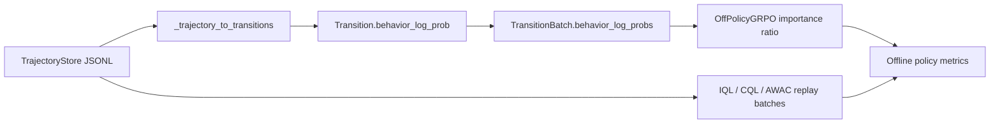

# offline-rl

`offline-rl` is the offline reinforcement learning package inside OpenClaw-RL-Offline.

It provides the reusable data and algorithm layer for collecting benchmark trajectories, replaying them offline, and training lightweight offline RL baselines before moving into full slime-based fine-tuning.

For a repository-level implementation audit, see [docs/implementation_status.md](./docs/implementation_status.md).

## Data Flow Diagram



## What This Package Includes

### Data Layer

- `TrajectoryStore`: JSONL storage for benchmark trajectories.
- `ReplayBuffer`: replay sampling over stored trajectories and transitions.
- `OfflineDataSource`: slime-compatible replay data source.
- `SampleLite`: lightweight sample container for converting between replay data and slime samples.

### Offline RL Algorithms

- `IQL`: implicit Q-learning for conservative offline policy extraction.
- `CQL`: conservative Q-learning for stronger out-of-distribution control.
- `AWAC`: advantage-weighted actor-critic for offline-to-online friendly fine-tuning.
- `Off-Policy GRPO`: replay-based GRPO aligned with the upstream OpenClaw training style, with support for replayed behavior-policy log-probs when available.

### Benchmark Adapters

- `MockOSWorldAdapter`
- `MockAndroidWorldAdapter`
- `MockWebArenaAdapter`
- `MockAlfWorldAdapter`

These adapters expose a shared `allocate/reset/get_obs/step/evaluate/close` API so that the same collection loop can be reused across benchmarks.

## Supported Benchmarks

| Benchmark | Mock adapter | Config file | Collector wrapper |
|---|---|---|---|
| OSWorld | Yes | `configs/osworld_tasks.json` | `scripts/run_collect_osworld.{sh,ps1}` |
| AndroidWorld | Yes | `configs/androidworld_tasks.json` | `scripts/run_collect_androidworld.{sh,ps1}` |
| WebArena | Yes | `configs/webarena_tasks.json` | `scripts/run_collect_webarena.{sh,ps1}` |
| AlfWorld | Yes | `configs/alfworld_tasks.json` | `scripts/run_collect_alfworld.{sh,ps1}` |

## Quick Start

### Install

```bash
pip install -e .
```

### Run the CPU test suite

```bash
python -m pytest tests -v
```

### Collect trajectories

```bash
python scripts/collect_from_benchmark.py --env osworld --n 100 --output data/osworld_trajs.jsonl
python scripts/collect_from_benchmark.py --env androidworld --n 100 --output data/androidworld_trajs.jsonl
python scripts/collect_from_benchmark.py --env webarena --n 100 --output data/webarena_trajs.jsonl
python scripts/collect_from_benchmark.py --env alfworld --n 100 --output data/alfworld_trajs.jsonl
```

Or use the thin wrapper scripts:

```bash
bash scripts/run_collect_osworld.sh
bash scripts/run_collect_androidworld.sh
bash scripts/run_collect_webarena.sh
bash scripts/run_collect_alfworld.sh
```

Or on Windows PowerShell:

```powershell
.\scripts\run_collect_osworld.ps1
.\scripts\run_collect_androidworld.ps1
.\scripts\run_collect_webarena.ps1
.\scripts\run_collect_alfworld.ps1
```

### Train lightweight offline baselines

```bash
python scripts/train_offline.py --algo iql --data data/osworld_trajs.jsonl --steps 500
python scripts/train_offline.py --algo cql --data data/webarena_trajs.jsonl --steps 500
python scripts/train_offline.py --algo awac --data data/alfworld_trajs.jsonl --steps 500
python scripts/train_offline.py --algo grpo --data data/osworld_trajs.jsonl --steps 200 --n-policy-updates 2
```

### Data contract for faithful Off-Policy GRPO

`Off-Policy GRPO` works with legacy replay data out of the box, but it becomes more faithful when the dataset contains behavior-policy log-probs. The replay buffer looks for the following fields in order:

- `step.info["behavior_log_prob"]`
- `step.info["old_log_prob"]`
- `step.info["rollout_log_probs"]` or `step.info["response_logprobs"]` as token-level lists, which are summed into a sequence log-prob
- `trajectory.metadata["behavior_log_probs"]`, `trajectory.metadata["old_log_probs"]`, or `trajectory.metadata["rollout_log_probs"]` as either step-indexed maps or per-step lists

If none of these fields are present, GRPO falls back to the frozen reference policy as an importance-ratio baseline. That fallback is convenient for old datasets, but it is less faithful than replaying the true behavior policy.

## Replay Data Decision Table

| Dataset property | GRPO behavior |
|---|---|
| Has scalar behavior log-probs per step | Uses them directly for off-policy ratios. |
| Has token-level rollout log-prob lists | Sums them into sequence log-probs and uses those. |
| Has only trajectory/reward data | Falls back to the reference-policy approximation. |
| Has no benchmark runtime installed | Still supports replay-based offline training from stored JSONL data. |

### Choosing an algorithm

| Algorithm | Best for | Current implementation notes |
|---|---|---|
| `IQL` | Conservative offline policy extraction and advantage weighting | Uses twin Q + V with lightweight text encoders. |
| `CQL` | Stronger out-of-distribution control | Uses a lightweight conservative regularizer over sampled action embeddings. |
| `AWAC` | Offline-to-online style actor updates | Good when you want explicit actor learning rather than pure value extraction. |
| `GRPO` | Replay-based policy optimization aligned with OpenClaw-style updates | Most useful when replay data already contains policy-side log-prob information. |

## Relation To openclaw-offline

Use `offline-rl` when you want:

- benchmark data collection;
- CPU-friendly validation of adapters and replay logic;
- lightweight offline RL experiments on replayed trajectories.

Use [openclaw-offline](../openclaw-offline/README.md) when you want to plug those trajectories into the full slime and Megatron training path for LLM fine-tuning.

## Compatibility

This package is intentionally shaped around the upstream OpenClaw and slime interfaces:

- replay output can be converted into slime samples;
- benchmark adapters follow the gui-rl environment lifecycle;
- Off-Policy GRPO keeps the same high-level training style as the online OpenClaw methods while accepting replayed behavior-policy log-probs.

## Current Boundaries

- CPU is sufficient for testing and small-scale replay experiments.
- Collection wrappers are available for both bash and PowerShell.
- The text encoders and tokenization scheme are intentionally lightweight and CPU-friendly; they are not meant to stand in for a full Qwen3-VL backbone.
- Real benchmark execution still depends on the corresponding external benchmark packages or services.
- Full LLM fine-tuning should be launched through `openclaw-offline`, not directly from this package.