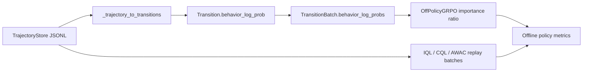

# offline-rl

`offline-rl` is the offline reinforcement learning package inside OpenClaw-RL-Offline.

It provides the reusable data and algorithm layer for collecting benchmark trajectories, replaying them offline, and training lightweight offline RL baselines before moving into full slime-based fine-tuning.

For a repository-level implementation audit, see [docs/implementation_status.md](./docs/implementation_status.md).

## Data Flow Diagram



## What This Package Includes

### Data Layer

- `TrajectoryStore`: JSONL storage for benchmark trajectories.
- `ReplayBuffer`: replay sampling over stored trajectories and transitions.
- `OfflineDataSource`: slime-compatible replay data source.
- `SampleLite`: lightweight sample container for converting between replay data and slime samples.

### Offline RL Algorithms

- `IQL`: implicit Q-learning for conservative offline policy extraction.
- `CQL`: conservative Q-learning for stronger out-of-distribution control.
- `AWAC`: advantage-weighted actor-critic for offline-to-online friendly fine-tuning.
- `Off-Policy GRPO`: replay-based GRPO aligned with the upstream OpenClaw training style, with support for replayed behavior-policy log-probs when available.
- `TD3+BC` (Fujimoto & Gu, NeurIPS 2021): deterministic actor with BC regularization; minimal hyperparameter overhead.
- `EDAC` (An et al., NeurIPS 2021): N-ensemble Q-critics with diversity penalty for pessimistic offline value estimation.
- `Decision Transformer` (Chen et al., NeurIPS 2021): return-conditioned causal sequence model; offline policy as supervised learning on (R, s, a) sequences.
- `CRR` (Wang et al., NeurIPS 2020): critic-regularized regression; advantage-weighted BC with MC V-baseline and configurable filter (exp / binary / softmax).
- `RW-FT` (Mukherjee et al., NeurIPS 2025): reward-weighted fine-tuning; simplest offline algorithm — trajectory-level reward-weighted BC, no critic required.
- `OREO` (Wang et al., arXiv 2412.16145): MaxEnt soft Bellman offline RL; single Q + GaussianActor; soft V via log-mean-exp over MC samples; advantage-weighted BC; validated on ALFWorld.
- `SORL` (Li et al., arXiv 2511.20718): stabilized off-policy GRPO with clipping-triggered normalization (CTN); normalizes advantages only when IS clip fraction exceeds threshold; prevents gradient collapse in long-horizon agentic settings.
- `ARPO` (arXiv 2505.16282): adaptive replay GRPO; per-task success buffer (FIFO, depth 8) injects a past success when a training group is all-fail; DAPO asymmetric clipping (ε_low=0.2, ε_high=0.3); no KL penalty; validated on OSWorld.
- `Retrospex` (Xiang et al., EMNLP 2024, arXiv 2505.11807): frozen LLM + offline IQL-style Q/V critic; no policy gradient; at inference, `rescore_actions()` combines LLM log-probs with the critic: `score(a|s) = lm_logp + λ·Q(s,a)`; suitable for frozen-policy settings where only the critic is trainable.
- `WebRL` (Qi et al., ICLR 2025, arXiv 2411.02337): off-policy GRPO augmented with an Outcome-Supervised Reward Model (ORM); ORM is a binary MLP classifier trained on outcome labels; augmented reward `r_aug = r_outcome + α·σ(ORM(s,a))` converts sparse trajectory rewards into dense per-step signals; curriculum difficulty tracker reports batch zone (easy/medium/hard).
- `GLIDER` (Hu et al., ICML 2025, arXiv 2505.19761): hierarchical offline RL; high-level `PlanEncoder` maps states to latent plan embeddings + IQL expectile value V_H trained on outcome rewards; low-level IQL Q+V+actor conditioned on plan-augmented states; AWR advantage-weighting at both levels; effectively reduces the per-step credit-assignment horizon.
- `ArCHer` (Zhou et al., ICML 2024, arXiv 2402.19446): hierarchical IQL+AWR for multi-turn dialogue agents; twin-Q + V critic with expectile regression (tau=0.9); AWR actor with advantage weighting; three separate optimizer groups (encoder, critic, actor).
- `BCQ` (Fujimoto et al., ICML 2019, arXiv 1812.02900): batch-constrained Q-learning; explicit BehaviorCloningNetwork constrains policy near data distribution; twin-Q + V with BC loss; prevents extrapolation error.
- `DPO` (Rafailov et al., NeurIPS 2023, arXiv 2305.18290): direct preference optimization; eliminates reward model via closed-form KL-constrained objective; intra-batch pairing of winners/losers by outcome reward threshold.
- `KTO` (Ethayarajh et al., ICML 2024, arXiv 2402.01306): Kahneman-Tversky optimization; works on single transitions with binary success/failure labels; no paired preference data required; loss-averse weighting of desirable vs undesirable outcomes.
- `REBEL` (Gao et al., NeurIPS 2024, arXiv 2404.16767): critic-free RL via pairwise reward regression; no value function; squared loss on reward differences; lightest-weight RL algorithm in the library.
- `DigiRL` (Bai et al., arXiv 2406.11896, 2024): doubly-robust offline RL for device-control agents; BCE-trained value functions (V_step, V_instruct); doubly-robust step advantage blending MC+TD; hard-filter AWR actor update.
- `DigiQ` (Bai et al., ICLR 2025, arXiv 2502.15760): three-stage offline RL for device-control agents; Stage I BCE representation fine-tuning predicts actionability; Stage II TD(0) Q-function and V-function learning on frozen features with Polyak-averaged target networks; Stage III Best-of-N policy extraction selects the highest-Q action among N candidates and trains via supervised learning.
- `Agent Q` (Putta et al., 2024, arXiv 2408.07199): MCTS-guided off-policy DPO for web agents; simulates K-action search per state in offline data; combined Q = α·Q_mcts + (1-α)·Q_critic with UCB1 exploration bonus; node-level preference pair construction with threshold filtering; off-policy DPO loss with reference policy.
- `ILQL` (Snell et al., ICLR 2023, arXiv 2206.11871): implicit language Q-learning; twin Q-networks with soft target updates; expectile-regression value function (τ=0.7); CQL conservative penalty via log-sum-exp over random actions; AWAC-style advantage-weighted behavior cloning for policy extraction; provides `get_advantages()` for downstream weight computation.
- `IPO` (Azar et al., AISTATS 2024, arXiv 2310.12036): identity preference optimization; squared-error loss on log-ratio margin `((h - 1/(2β))²)` bypasses the Bradley-Terry model assumption; same pairing mechanism as DPO.
- `CPO` (Xu et al., ICML 2024, arXiv 2401.08417): contrastive preference optimization; DPO loss plus behavior cloning regularization on winners `L = L_DPO + λ_BC · L_BC`; dual objective prevents winning-response degradation.
- `SimPO` (Meng et al., NeurIPS 2024, arXiv 2405.14734): simple preference optimization; reference-free — no reference model required, 50% less memory; uses target margin γ in `h = β·(log_π_w − log_π_l) − γ`.
- `DMPO` (Shi et al., EMNLP 2024, arXiv 2406.14868): direct multi-turn preference optimization; length-normalized DPO for multi-turn agent trajectories; applies `weight = 1/len^p` normalization to compensate for trajectory length bias.
- `ETO` (Song et al., ACL 2024, arXiv 2403.02502): exploration-based trajectory optimization; exploration-weighted DPO that upweights near-miss failures via `explore_weight = exp(α · r_loser)`; normalized by mean for gradient stability.
- `VEM` (Song et al., Microsoft 2025, arXiv 2502.18906): value environment model; two-stage training — MLP value model trained on detached encoder outputs, then AWR policy loss with encoder gradients; three optimizer groups (encoder, VEM, policy).

### Benchmark Adapters

- `MockOSWorldAdapter`
- `MockAndroidWorldAdapter`
- `MockWebArenaAdapter`
- `MockAlfWorldAdapter`

These adapters expose a shared `allocate/reset/get_obs/step/evaluate/close` API so that the same collection loop can be reused across benchmarks.

## Supported Benchmarks

| Benchmark | Mock adapter | Config file | Collector wrapper |
|---|---|---|---|
| OSWorld | Yes | `configs/osworld_tasks.json` | `scripts/run_collect_osworld.{sh,ps1}` |
| AndroidWorld | Yes | `configs/androidworld_tasks.json` | `scripts/run_collect_androidworld.{sh,ps1}` |
| WebArena | Yes | `configs/webarena_tasks.json` | `scripts/run_collect_webarena.{sh,ps1}` |
| AlfWorld | Yes | `configs/alfworld_tasks.json` | `scripts/run_collect_alfworld.{sh,ps1}` |

## Quick Start

### Install

```bash
pip install -e .
```

### Run the CPU test suite

```bash
python -m pytest tests -v
```

### Collect trajectories

```bash
python scripts/collect_from_benchmark.py --env osworld --n 100 --output data/osworld_trajs.jsonl
python scripts/collect_from_benchmark.py --env androidworld --n 100 --output data/androidworld_trajs.jsonl
python scripts/collect_from_benchmark.py --env webarena --n 100 --output data/webarena_trajs.jsonl
python scripts/collect_from_benchmark.py --env alfworld --n 100 --output data/alfworld_trajs.jsonl
```

Or use the thin wrapper scripts:

```bash
bash scripts/run_collect_osworld.sh
bash scripts/run_collect_androidworld.sh
bash scripts/run_collect_webarena.sh
bash scripts/run_collect_alfworld.sh
```

Or on Windows PowerShell:

```powershell
.\scripts\run_collect_osworld.ps1
.\scripts\run_collect_androidworld.ps1
.\scripts\run_collect_webarena.ps1
.\scripts\run_collect_alfworld.ps1
```

### Train lightweight offline baselines

```bash
python scripts/train_offline.py --algo iql --data data/osworld_trajs.jsonl --steps 500
python scripts/train_offline.py --algo cql --data data/webarena_trajs.jsonl --steps 500
python scripts/train_offline.py --algo awac --data data/alfworld_trajs.jsonl --steps 500
python scripts/train_offline.py --algo td3bc --data data/osworld_trajs.jsonl --steps 500 --td3bc-alpha 2.5
python scripts/train_offline.py --algo edac --data data/osworld_trajs.jsonl --steps 500 --edac-n-critics 5 --edac-eta 1.0
python scripts/train_offline.py --algo dt   --data data/osworld_trajs.jsonl --steps 300 --dt-context-len 20
python scripts/train_offline.py --algo crr  --data data/osworld_trajs.jsonl --steps 500 --crr-filter exp --crr-beta 1.0
python scripts/train_offline.py --algo rwft --data data/osworld_trajs.jsonl --steps 300 --rwft-beta 1.0
python scripts/train_offline.py --algo oreo --data data/osworld_trajs.jsonl --steps 500 --oreo-beta 1.0 --oreo-mc-samples 8
python scripts/train_offline.py --algo sorl --data data/osworld_trajs.jsonl --steps 500 --sorl-clip-norm-threshold 0.2
python scripts/train_offline.py --algo arpo --data data/osworld_trajs.jsonl --steps 500 --arpo-clip-ratio-high 0.3 --arpo-buffer-size 8
python scripts/train_offline.py --algo retrospex --data data/osworld_trajs.jsonl --steps 500 --retrospex-tau 0.7 --retrospex-lambda-scale 1.0
python scripts/train_offline.py --algo webrl --data data/osworld_trajs.jsonl --steps 500 --webrl-alpha-orm 0.5
python scripts/train_offline.py --algo glider --data data/osworld_trajs.jsonl --steps 500 --glider-plan-dim 64 --glider-beta 1.0
python scripts/train_offline.py --algo archer --data data/osworld_trajs.jsonl --steps 500 --archer-tau 0.9 --archer-beta 3.0
python scripts/train_offline.py --algo bcq --data data/osworld_trajs.jsonl --steps 500 --bcq-tau 0.7 --bcq-bc-weight 1.0
python scripts/train_offline.py --algo dpo --data data/osworld_trajs.jsonl --steps 500 --dpo-beta 0.1
python scripts/train_offline.py --algo kto --data data/osworld_trajs.jsonl --steps 500
python scripts/train_offline.py --algo rebel --data data/osworld_trajs.jsonl --steps 500 --rebel-eta 1.0
python scripts/train_offline.py --algo digirl --data data/osworld_trajs.jsonl --steps 500 --digirl-lam 0.5 --digirl-adv-threshold 0.1
python scripts/train_offline.py --algo ipo --data data/osworld_trajs.jsonl --steps 500 --ipo-beta 0.1
python scripts/train_offline.py --algo cpo --data data/osworld_trajs.jsonl --steps 500 --cpo-beta 0.1 --cpo-lambda-bc 1.0
python scripts/train_offline.py --algo simpo --data data/osworld_trajs.jsonl --steps 500 --simpo-beta 2.0 --simpo-gamma 0.5
python scripts/train_offline.py --algo dmpo --data data/osworld_trajs.jsonl --steps 500 --dmpo-beta 0.1 --dmpo-length-power 0.5
python scripts/train_offline.py --algo eto --data data/osworld_trajs.jsonl --steps 500 --eto-beta 0.1 --eto-explore-alpha 1.0
python scripts/train_offline.py --algo vem --data data/osworld_trajs.jsonl --steps 500 --vem-beta 1.0 --vem-alpha-awr 1.0
python scripts/train_offline.py --algo grpo --data data/osworld_trajs.jsonl --steps 200 --n-policy-updates 2 --device cuda

# Compare multiple algorithms side-by-side
python scripts/evaluate_algorithms.py --data data/osworld_trajs.jsonl --algos iql cql td3bc crr oreo sorl --steps 200 --output results/comparison.csv
```

Or use the launcher wrappers with environment variables, closer to the style of the upstream OpenClaw shell entry points:

```bash
OFFLINE_TRAIN_ALGO=grpo OFFLINE_TRAIN_DATA=data/osworld_trajs.jsonl bash scripts/run_train_offline.sh
```

```powershell
$env:OFFLINE_TRAIN_ALGO = "grpo"
$env:OFFLINE_TRAIN_DATA = "data/osworld_trajs.jsonl"
.\scripts\run_train_offline.ps1
```

The direct trainer now defaults to `cuda`, matching the GPU-first expectation of the upstream OpenClaw launch scripts. It also supports `cuda:N`, `auto`, and `cpu` when you need an explicit override. This path is still a lightweight single-process trainer for replay experiments, not a replacement for the multi-GPU slime launch path.

If you are validating on a CPU-only development machine, pass `--device cpu` explicitly.

### Data contract for faithful Off-Policy GRPO

`Off-Policy GRPO` works with legacy replay data out of the box, but it becomes more faithful when the dataset contains behavior-policy log-probs. The replay buffer looks for the following fields in order:

- `step.info["behavior_log_prob"]`
- `step.info["old_log_prob"]`
- `step.info["rollout_log_probs"]` or `step.info["response_logprobs"]` as token-level lists, which are summed into a sequence log-prob
- `trajectory.metadata["behavior_log_probs"]`, `trajectory.metadata["old_log_probs"]`, or `trajectory.metadata["rollout_log_probs"]` as either step-indexed maps or per-step lists

If none of these fields are present, GRPO falls back to the frozen reference policy as an importance-ratio baseline. That fallback is convenient for old datasets, but it is less faithful than replaying the true behavior policy.

## Replay Data Decision Table

| Dataset property | GRPO behavior |
|---|---|
| Has scalar behavior log-probs per step | Uses them directly for off-policy ratios. |
| Has token-level rollout log-prob lists | Sums them into sequence log-probs and uses those. |
| Has only trajectory/reward data | Falls back to the reference-policy approximation. |
| Has no benchmark runtime installed | Still supports replay-based offline training from stored JSONL data. |

### Choosing an algorithm

| Algorithm | Best for | Current implementation notes |
|---|---|---|
| `IQL` | Conservative offline policy extraction and advantage weighting | Uses twin Q + V with lightweight text encoders. |
| `CQL` | Stronger out-of-distribution control | Uses a lightweight conservative regularizer over sampled action embeddings. |
| `AWAC` | Offline-to-online style actor updates | Good when you want explicit actor learning rather than pure value extraction. |
| `TD3+BC` | Minimalist BC-regularized policy learning (Fujimoto & Gu, NeurIPS 2021) | Twin Q-networks + deterministic actor; policy loss = −λQ + BC; λ adapts to Q magnitude. |
| `EDAC` | Uncertainty-penalized offline Q-learning with ensemble (An et al., NeurIPS 2021) | N-critics (default 10); SAC-style stochastic actor; pessimistic target Q_min − η·Q_std; auto-tuned alpha. |
| `DT` | Return-conditioned sequence modeling (Chen et al., NeurIPS 2021) | Causal Transformer; 3-token interleaved (R, s, a); offline policy as supervised learning on fixed target returns. |
| `CRR` | Advantage-weighted BC for high-quality offline datasets (Wang et al., NeurIPS 2020) | Twin Q + MC V-baseline (K=8 samples); exp/binary/softmax filter; selective update from positive-advantage transitions. |
| `RW-FT` | Simplest reward-weighted fine-tuning for LLM agents (Mukherjee et al., NeurIPS 2025) | Trajectory-level outcome reward as softmax weight for BC loss; no critic; suitable for best-of-N dataset distillation. |
| `OREO` | Principled soft Bellman offline RL for agentic LLM trajectories (Wang et al., arXiv 2412.16145) | Single Q + GaussianActor; V_soft = β·log_mean_exp(Q(s,aₖ)/β) over K MC samples; consistent MaxEnt entropy objective; no twin Q overhead. |
| `SORL` | Stabilized off-policy GRPO for long-horizon agentic tasks (Li et al., arXiv 2511.20718) | Subclass of OffPolicyGRPO; CTN normalizes advantages only when IS clip fraction > threshold (default 0.2); tracks clip_fraction and ctn_normalized metrics. |
| `ARPO` | Adaptive replay GRPO for sparse-reward agentic tasks (arXiv 2505.16282) | Per-task FIFO success buffer (depth 8); injects 1 past success when group is all-fail (std<0.05 and mean<0.2); DAPO asymmetric clip (ε_low=0.2, ε_high=0.3); no KL; OSWorld validated. |
| `Retrospex` | Frozen-LLM offline RL — inference-time critic rescoring (Xiang et al. EMNLP 2024) | Trains IQL-style twin Q + V entirely offline; at inference `rescore_actions()` combines LLM log-probs with Q-values; LLM weights never updated; drop-in for any frozen agent. |
| `WebRL` | ORM-augmented GRPO for web agents (Qi et al. ICLR 2025) | Binary ORM MLP trained on outcome labels provides per-step dense reward; `r_aug = r_outcome + α·σ(ORM)`; curriculum difficulty reporting; suitable when sparse outcome labels are the only supervision. |
| `GLIDER` | Hierarchical offline RL — plan+execution decomposition (Hu et al. ICML 2025) | Two-level IQL: high-level plan encoder + V_H on outcome rewards, low-level Q+actor conditioned on plan embedding; reduces effective credit-assignment horizon for long-horizon tasks. |
| `ArCHer` | Hierarchical IQL+AWR for multi-turn dialogue agents (Zhou et al. ICML 2024) | Twin-Q + V with expectile regression (tau=0.9); AWR actor; three optimizer groups; suitable for multi-turn agentic trajectories. |
| `BCQ` | Batch-constrained Q-learning (Fujimoto et al. ICML 2019) | Explicit BehaviorCloningNetwork constrains policy near data; twin-Q + V; prevents extrapolation error on OOD actions. |
| `DPO` | Direct preference optimization for LLM alignment (Rafailov et al. NeurIPS 2023) | Eliminates reward model; intra-batch pairing by outcome threshold; contrastive log-ratio loss. |
| `KTO` | Kahneman-Tversky optimization for binary feedback (Ethayarajh et al. ICML 2024) | Works with single transitions + binary labels; no preference pairs needed; loss-averse weighting. |
| `REBEL` | Critic-free pairwise reward regression (Gao et al. NeurIPS 2024) | No value function; lightest-weight RL; squared loss on reward differences; only needs policy + rewards. |
| `DigiRL` | Doubly-robust offline RL for device-control agents (Bai et al. 2024) | BCE value functions; doubly-robust MC+TD advantage; hard-filter AWR; per-step success probability output. |
| `IPO` | Identity preference optimization bypassing BT model (Azar et al. AISTATS 2024) | Squared-error loss `((h - 1/(2β))²)`; same pairing as DPO; more robust to label noise. |
| `CPO` | Contrastive preference optimization with BC regularization (Xu et al. ICML 2024) | DPO + λ·BC on winners; prevents winning-response quality degradation. |
| `SimPO` | Reference-free preference optimization (Meng et al. NeurIPS 2024) | No reference model; 50% less memory; target margin γ; simplest preference algorithm. |
| `DMPO` | Multi-turn DPO with length normalization (Shi et al. EMNLP 2024) | Length-normalized DPO; weight=1/len^p; compensates trajectory length bias for agents. |
| `ETO` | Exploration-weighted DPO for agent tasks (Song et al. ACL 2024) | Upweights near-miss failures via exp(α·r_loser); mean-normalized for stability. |
| `VEM` | Value environment model + AWR policy (Song et al. Microsoft 2025) | Two-stage: MLP value model on detached features, then AWR policy; 3 optimizer groups. |
| `GRPO` | Replay-based policy optimization aligned with OpenClaw-style updates | Most useful when replay data already contains policy-side log-prob information. |

## Relation To openclaw-offline

Use `offline-rl` when you want:

- benchmark data collection;
- CPU-friendly validation of adapters and replay logic;
- lightweight offline RL experiments on replayed trajectories.

Use [openclaw-offline](../openclaw-offline/README.md) when you want to plug those trajectories into the full slime and Megatron training path for LLM fine-tuning.

## Compatibility

This package is intentionally shaped around the upstream OpenClaw and slime interfaces:

- replay output can be converted into slime samples;
- benchmark adapters follow the gui-rl environment lifecycle;
- Off-Policy GRPO keeps the same high-level training style as the online OpenClaw methods while accepting replayed behavior-policy log-probs.

## Current Boundaries

- The direct trainer is now GPU-first by default and supports explicit CPU fallback for local validation.
- Collection wrappers are available for both bash and PowerShell.
- The text encoders and tokenization scheme are intentionally lightweight and CPU-friendly; they are not meant to stand in for a full Qwen3-VL backbone.
- Real benchmark execution still depends on the corresponding external benchmark packages or services.
- Full LLM fine-tuning should be launched through `openclaw-offline`, not directly from this package.