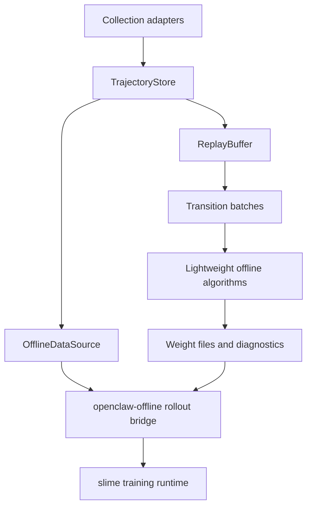

# Offline Implementation Status

This document explains what OpenClaw-RL-Offline implements today, what is intentionally lightweight, and how to interpret the offline claims in the repository.

## Summary

OpenClaw-RL-Offline is not an empty scaffold. The repository contains a real offline data plane, functional lightweight offline RL baselines, and a real bridge back into the original slime-based LLM training flow. At the same time, some components are explicitly designed for CPU validation and research iteration rather than for immediate large-scale Qwen3-VL training.

## Architecture View

## Claim Tier Matrix

| Claim | Supported by code and tests | External dependency remains |
|---|---|---|
| Offline JSONL data and replay are implemented | Yes | No |
| Lightweight offline RL baselines are runnable | Yes | No |
| Replay-aware Off-Policy GRPO exists | Yes | Only legacy datasets may fall back to reference-policy ratios |
| Benchmark collection interfaces exist for four benchmarks | Yes | Real benchmark execution still requires upstream packages or services |
| Full offline LLM training path exists | Yes | Yes, via slime runtime, checkpoints, and Linux-like multi-GPU setup |

## Fully Implemented Components

| Area | What is implemented | Why it matters |
|---|---|---|
| Trajectory storage | `TrajectoryStore` streams JSONL trajectories, supports append/filter/stats, and is designed for low-memory machines. | Offline work depends on stable replayable datasets. |
| Replay sampling | `ReplayBuffer` supports transition sampling, trajectory sampling, and prioritized replay. | The algorithms operate on actual replay batches rather than mocked tensors. |
| Offline algorithms | All 32 algorithms (`IQL`, `CQL`, `AWAC`, `OffPolicyGRPO`, `TD3+BC`, `EDAC`, `DT`, `CRR`, `RW-FT`, `OREO`, `SORL`, `ARPO`, `Retrospex`, `WebRL`, `GLIDER`, `ArCHer`, `BCQ`, `DPO`, `KTO`, `REBEL`, `DigiRL`, `DigiQ`, `Agent Q`, `ILQL`, `IPO`, `CPO`, `SimPO`, `DMPO`, `ETO`, `VEM`, `ORPO`, `RRHF`) have working training loops, metrics, and tests. | The repo contains executable offline RL baselines, not placeholder class shells. |
| Behavior-policy ratio support | `OffPolicyGRPO` now consumes replayed behavior-policy log-probs when the dataset provides them. | This makes the off-policy objective more faithful than using only a frozen reference-policy proxy. |
| slime bridge | `openclaw-offline/offline_rollout.py` and `openclaw-offline/offline_loss.py` replay offline data through the original slime interfaces. | Offline data can be used without inventing a separate toy trainer stack. |
| Benchmark workflow | Mock adapters, task configs, and collection wrappers exist for OSWorld, AndroidWorld, WebArena, and AlfWorld. | The offline pipeline can be validated on CPU without requiring every external simulator during development. |

## Intentionally Lightweight Components

| Area | Current design | Practical interpretation |
|---|---|---|
| Text encoders | The offline baselines use small hash-tokenizer plus embedding/MLP encoders. | Good for CPU tests and algorithmic validation, not a drop-in replacement for a large multimodal backbone. |
| CQL action coverage | The conservative regularizer samples lightweight random action embeddings instead of a full action generator. | Suitable for a research baseline, but still a simplification of full LLM action spaces. |
| GRPO fallback mode | If replayed behavior-policy log-probs are absent, GRPO falls back to a frozen reference policy. | Convenient for legacy datasets, but less faithful than real behavior-policy replay. |
| Benchmark execution | The repository includes mock adapters and guarded real integrations. | Real benchmark fidelity still depends on external packages, services, simulators, and environment setup. |

## What This Repository Does Not Claim

- It does not claim that the lightweight offline baselines are the same thing as full Qwen3-VL actor training.
- It does not claim that mock benchmark adapters are equivalent to real benchmark execution.
- It does not claim that Windows PowerShell alone is enough for distributed slime training.
- It does not claim to replace the upstream OpenClaw runtime; it reuses it for the final fine-tuning path.

## Recommended Interpretation

Use this repository when you need one of the following:

1. A reproducible offline data and replay stack built around the OpenClaw ecosystem.
2. CPU-friendly offline RL baselines for ablations, sanity checks, and pipeline validation.
3. A way to replay collected benchmark trajectories back into the original slime training path.

If your goal is full large-scale multimodal training, treat this repository as the offline data-and-bridge layer around that workflow rather than as a replacement for the upstream multi-GPU runtime.